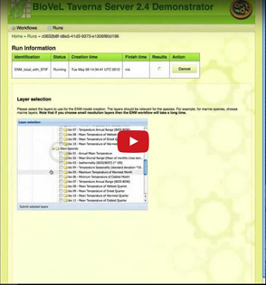

Title:     Interactions
Notice:    Licensed to the Apache Software Foundation (ASF) under one
           or more contributor license agreements.  See the NOTICE file
           distributed with this work for additional information
           regarding copyright ownership.  The ASF licenses this file
           to you under the Apache License, Version 2.0 (the
           "License"); you may not use this file except in compliance
           with the License.  You may obtain a copy of the License at
           .
             http://www.apache.org/licenses/LICENSE-2.0
           .
           Unless required by applicable law or agreed to in writing,
           software distributed under the License is distributed on an
           "AS IS" BASIS, WITHOUT WARRANTIES OR CONDITIONS OF ANY
           KIND, either express or implied.  See the License for the
           specific language governing permissions and limitations
           under the License.

##Interacting with a workflow in your browser

Many workflows, when run, require interaction with a user.
This can be to enter data values, confirm that intermediate results are OK to proceed with the
   run, or to control the functionality of a service.

### Beanshells
When running a workflow in [Taverna Workbench](/download/workbench) you can use beanshells
   to show Java swing components. Taverna Workbench includes a set of pre-defined beanshells to,
   for example, [Ask](http://dev.mygrid.org.uk/wiki/display/taverna/Ask) the user for data.

### BioVeL interaction service
If you run your workflow in a portal or on a [server](/download/server), then using beanshells
   for interaction will not work. Attempts to use Swing will either fail or, worse,
   open dialogs on the machine where the workflow is running.

To support interaction with workflows running on a server, the [BioVeL](http://www.biovel.eu)
   project developed a new
   [interaction service](http://dev.mygrid.org.uk/wiki/display/taverna/Interaction+service).
This interaction service allows users to interact with a running workflow within a standard web
   browser.
The interaction can be as simple as acknowledging a message,
   or as complex as controlling a tool running on a remote machine.
The interaction can be parameterized by data from the workflow and can return data from the
   browser to the workflow.

Interactions have already been used for many purposes. These include:

 - manipulating data inside [Open Refine](http://openrefine.org/) (previously Google Refine),
 - showing information on maps, and
 - showing the results of species population modelling.

## Notification of interaction requests

One of the advantages of running workflows on a server is that you do not need to monitor them
   constantly.
However, you then need a way to be alerted that a workflow requires an interaction.
The interaction service uses [ATOM](http://bit.ly/29EOgfP) feeds to send
   out notifications.
ATOM feeds can be read by many different clients, including mobile phone Apps and mail readers.
The ATOM message will include a link to the HTML page for the interaction required.

## Usage scenarios

The interaction service combines standard protocols such as ATOM and HTML.
As a result there are many ways in which users can interact with their workflow run.

### On your phone

Most modern mobile/cell phones support web browsers and also ATOM feed Apps.
If you subscribe to the ATOM feed for a workflow run,
   you can open the HTML page in the phone's browser, interact with the workflow run,
   and then go back to whatever you were doing.

This has been demonstrated for simple interactions. Complex interactions can be limited by a
  phone's screen resolution.

### Inside another web page

It is common to use a web page to run workflows on a server.
This could be, for example, within a
   [Taverna Player](/documentation/taverna-player),
   or a more complex portal such as the Taverna 2.4 Server Demonstrator.
When a workflow is run, the page creates a subscription to the run's ATOM feed.
When a notification is sent on the feed, the page can then show the interaction.
An example of this is demonstrated in the video.

### In the workbench

The Taverna Workbench is also able to run interaction services.
When a notification is sent, it opens up the HTML page in your preferred browser.
You can choose to use <a title="Jetty" href="http://www.eclipse.org/jetty/">Jetty</a> to handle the feed and hosting of pages, or an external site.

<h2>Installing the interaction service</h2>

The interaction service is an official plugin for the workbench. Installation instructions can be found in the <a href="http://dev.mygrid.org.uk/wiki/display/taverna/Finding+plugins">user manual</a>.

A version of the Taverna Server including the interaction service is available. For details about access, please contact <a href="mailto:support@mygrid.org.uk">support@mygrid.org.uk</a>

